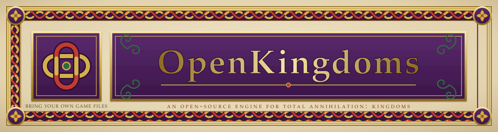

<!-- ───────────────────────────────────────────────────────────────────────
     STAGING DRAFT — delete this banner before the repo is published.

     This README is written as it should read AT LAUNCH. Before publishing,
     every claim below must actually be true. Blocking on:
       • runtime data path + built-in HPI reading  (OPEN_SOURCE_PLAN §4a)
       • browser bring-your-own-data flow          (OPEN_SOURCE_PLAN §5)
       • release artifacts actually built by CI    (release.yml)
     Placeholders to fill: org/account in links, hosted URL, GIF, release links.
     ─────────────────────────────────────────────────────────────────── -->

<p align="center">
  
</p>

# OpenTAK

A from-scratch, open-source engine for **Total Annihilation: Kingdoms**
(Cavedog, 1999) — written in C11, running natively on Windows, macOS and
Linux, and in the browser via WebAssembly.

<!-- TODO before public: docs/img/gameplay.gif — a short capture of an
     actual skirmish. Gameplay screenshots are standard for these projects
     (OpenRA/OpenMW use them); the banner above is original art so the
     repo itself carries no Cavedog/Atari artwork. -->

OpenTAK is a *reimplementation*, not a mod or a patch. The original game's
rules — its economy, unit behaviour, combat maths, animation system and map
format — have been reconstructed and reimplemented so the game runs on
modern machines without DirectDraw, DirectPlay or a 1999 CPU.

> **You need your own copy of the game.** OpenTAK ships the engine only. It
> contains no units, models, textures, sounds, maps or music — those are
> still owned by their rights holders, and we don't distribute them. Point
> OpenTAK at a copy of the game you own and it does the rest. See
> **[docs/ASSETS.md](docs/ASSETS.md)**.

---

## Status

Honest state of things:

| Area | State |
|---|---|
| Skirmish vs AI | Playable — economy, building, combat, magic, victory conditions |
| Rendering | 3DO models, GAF/TAF sprites, COB animation, team colours, fog of war |
| Pathfinding | Working; ongoing accuracy work on tight corridors |
| Maps | TNT loading, heightmaps, features |
| Multiplayer | **In development** — lockstep netcode, not yet released |
| Campaign / story mode | **Not playable yet** |
| Sound | Effects and music |

Expect rough edges. This is a preservation project under active
development, not a finished product.

---

## Play in your browser

The fastest way in — nothing to install.

1. Go to **<https://opentak.example/play>**
2. Click **Locate game files** and select your Total Annihilation: Kingdoms
   folder (or drag the `.hpi` files onto the page).
3. Play.

Your game files **never leave your machine**. The browser reads them
locally and caches them so the second visit is instant. There's a "forget
my data" button in the settings if you want them gone.

Chrome and Edge get the folder picker. Firefox and Safari use drag-and-drop
of the `.hpi` files instead — same result, one extra step.

---

## Windows

**Download and play**

1. Grab `OpenTAK-windows-x64.zip` from the [latest release](https://github.com/zbennett10/open-tak/releases/latest).
2. Unzip it anywhere and run `OpenTAK.exe`.
3. On first launch it asks for your Total Annihilation: Kingdoms folder.

**Build from source**

Requires [Visual Studio 2022](https://visualstudio.microsoft.com/) (Desktop
C++ workload), [CMake](https://cmake.org/download/) 3.20+, and
[vcpkg](https://vcpkg.io/).

```powershell
git clone https://github.com/zbennett10/open-tak.git
cd open-tak
cmake -B build -DCMAKE_TOOLCHAIN_FILE=<vcpkg>/scripts/buildsystems/vcpkg.cmake
cmake --build build --config Release
.\build\src\Release\tak-re.exe
```

---

## macOS

**Download and play**

1. Grab `OpenTAK-macos-universal.zip` from the [latest release](https://github.com/zbennett10/open-tak/releases/latest).
2. Unzip and move `OpenTAK.app` to Applications.
3. macOS will refuse to open it — the build isn't code-signed (Apple
   charges for that; this is a free project). Clear the quarantine flag:
   ```bash
   xattr -dr com.apple.quarantine /Applications/OpenTAK.app
   ```
4. Launch it and point it at your game folder.

Builds are universal — native on both Apple Silicon and Intel.

**Build from source**

```bash
brew install cmake sdl2 ninja
git clone https://github.com/zbennett10/open-tak.git
cd open-tak
cmake -B build -G Ninja -DCMAKE_BUILD_TYPE=Release
cmake --build build
./build/src/tak-re
```

---

## Linux

**Build from source** (the release tarball works too, but distros vary
enough that building is usually smoother).

Install dependencies:

```bash
# Debian / Ubuntu
sudo apt install build-essential cmake ninja-build libsdl2-dev

# Fedora
sudo dnf install gcc cmake ninja-build SDL2-devel

# Arch
sudo pacman -S base-devel cmake ninja sdl2
```

Then:

```bash
git clone https://github.com/zbennett10/open-tak.git
cd open-tak
cmake -B build -G Ninja -DCMAKE_BUILD_TYPE=Release
cmake --build build
./build/src/tak-re
```

You do **not** need Wine or Proton. This is a native port, not a
compatibility layer.

---

## Getting your game files in

OpenTAK reads the original game's `.hpi` archives directly. On first run it
asks where they are; after that it remembers.

Where to get a copy if you don't have one:

- **GOG** sells it as part of the *Total Annihilation Commander Pack*.
- Original CDs work fine — copy the game folder off the disc.

Full details, including how to pass the path on the command line and how to
use loose extracted files instead, are in **[docs/ASSETS.md](docs/ASSETS.md)**.

---

## Multiplayer

Lockstep netcode over a lightweight relay. The server passes command frames
between players and holds no game state and no game data, so hosting one for
your friends is cheap and legally uncomplicated.

Status: **in development.** Hosting instructions land with the release —
see [docs/MULTIPLAYER.md](docs/MULTIPLAYER.md) for the design.

---

## Contributing

Contributions are very welcome, especially from people who know the
original game well. Accuracy reports are as valuable as code: if something
behaves differently from the 1999 game, that's a bug worth filing.

Start with **[CONTRIBUTING.md](CONTRIBUTING.md)**. The short version:

- OpenTAK aims at **behavioural parity** with the original. Changes to game
  behaviour need evidence — a note in `docs/notes/`, a manual reference, or
  a reproducible in-game observation.
- Build both the native **and** the WebAssembly target before opening a PR.
  Emscripten's clang rejects things MSVC accepts.
- Tests live beside the code as `test_*.c`. CI runs the data-free subset;
  maintainers run the full suite.

---

## How this was built

OpenTAK is a reimplementation, written from scratch in C. The original
game's behaviour — economy, combat, animation, AI, map handling — is
described in our own words in **[docs/notes/](docs/notes/)**, and those
notes are the reference contributors work from. No original game code or
content is included in this repository, and none ever will be.

What "parity" means here and how claims are evidenced:
[docs/PARITY.md](docs/PARITY.md).
Deliberate departures from the original, and why:
[docs/MANUAL_DEVIATIONS.md](docs/MANUAL_DEVIATIONS.md).
File format reference (HPI, 3DO, GAF/TAF, COB, TNT, TDF/FBI):
[docs/DATA_FORMATS.md](docs/DATA_FORMATS.md).

---

## Licence and attribution

OpenTAK is licensed under the **GNU General Public License v3.0** — see
[LICENSE](LICENSE).

Third-party components keep their own licences: SDL2 (zlib), miniaudio
(public domain / MIT-0), stb_image (MIT / public domain), miniz (MIT).

*Total Annihilation: Kingdoms* is a trademark of its respective owners.
This project is not affiliated with, endorsed by, or supported by Cavedog
Entertainment, Atari, or any current rights holder. No game assets are
distributed here.
