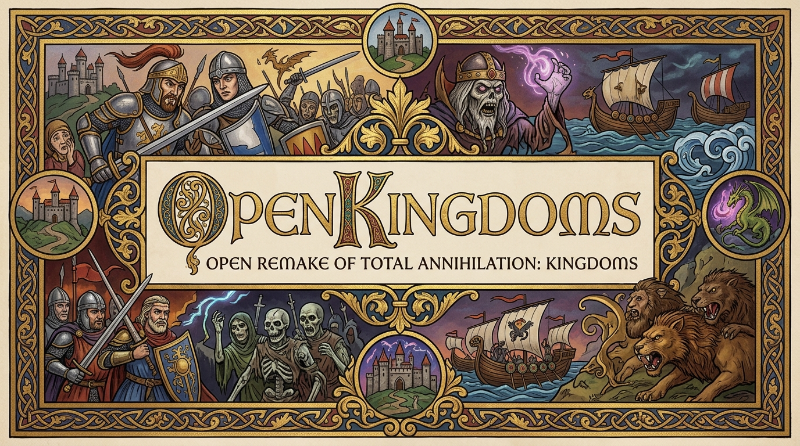

<p align="center">
  
</p>

# OpenKingdoms

A from-scratch, open-source engine for **Total Annihilation: Kingdoms**
(Cavedog, 1999) — written in C11, running natively on Windows, macOS and
Linux, and in the browser via WebAssembly.

OpenKingdoms is a *reimplementation*, not a mod or a patch. The original game's
rules — its economy, unit behaviour, combat maths, animation system and map
format — have been reconstructed and reimplemented so the game runs on
modern machines without DirectDraw, DirectPlay or a 1999 CPU.

> **You need your own copy of the game.** OpenKingdoms ships the engine only. It
> contains no units, models, textures, sounds, maps or music — those are
> still owned by their rights holders, and we don't distribute them. Point
> OpenKingdoms at a copy of the game you own and it does the rest. See
> **[docs/ASSETS.md](docs/ASSETS.md)**.

---

## Status

Honest state of things:

| Area | State |
|---|---|
| Skirmish vs AI | Playable — economy, building, combat, magic, victory conditions |
| Rendering | 3DO models, GAF/TAF sprites, COB animation, team colours, fog of war |
| Pathfinding | Working; ongoing accuracy work on tight corridors |
| Maps | TNT loading, heightmaps, features |
| Multiplayer | **In development** — lockstep netcode, not yet released |
| Campaign / story mode | **Not playable yet** |
| Sound | Effects and music |

Expect rough edges. This is a preservation project under active
development, not a finished product.

---

## Play in your browser

**Not hosted yet.** The engine already compiles to WebAssembly — CI builds
it on every commit — but the hosted page with the in-browser game-folder
picker is still being built. The design: you visit the page once, point it
at your Total Annihilation: Kingdoms folder (or drop the `.hpi` files on
it), and play. Your files never leave your machine; the browser reads them
locally and caches them for next time. Until that lands, build natively
below.

---

## Windows

**Pre-built downloads: not yet.** The first tagged release will include
them. Until then, building from source takes a few minutes.

Requires [Visual Studio 2022](https://visualstudio.microsoft.com/) (Desktop
C++ workload), [CMake](https://cmake.org/download/) 3.20+, and
[vcpkg](https://vcpkg.io/).

```powershell
git clone https://github.com/OpenKingdoms/OpenKingdoms.git
cd OpenKingdoms
cmake -B build -DCMAKE_TOOLCHAIN_FILE=<vcpkg>/scripts/buildsystems/vcpkg.cmake `
      -DTAK_GAME_DIR="C:\GOG Games\Total Annihilation Kingdoms"
cmake --build build --config Release
.\build\src\Release\tak-re.exe
```

---

## macOS

**Pre-built downloads: not yet** — they come with the first release
(unsigned, so expect the `xattr -dr com.apple.quarantine` step). Building
from source works today on both Apple Silicon and Intel:

```bash
brew install cmake sdl2 ninja
git clone https://github.com/OpenKingdoms/OpenKingdoms.git
cd OpenKingdoms
cmake -B build -G Ninja -DCMAKE_BUILD_TYPE=Release       -DTAK_GAME_DIR="/path/to/Total Annihilation Kingdoms"
cmake --build build
./build/src/tak-re
```

---

## Linux

**Build from source.** Install dependencies:

```bash
# Debian / Ubuntu
sudo apt install build-essential cmake ninja-build libsdl2-dev

# Fedora
sudo dnf install gcc cmake ninja-build SDL2-devel

# Arch
sudo pacman -S base-devel cmake ninja sdl2
```

Then:

```bash
git clone https://github.com/OpenKingdoms/OpenKingdoms.git
cd OpenKingdoms
cmake -B build -G Ninja -DCMAKE_BUILD_TYPE=Release       -DTAK_GAME_DIR="/path/to/Total Annihilation Kingdoms"
cmake --build build
./build/src/tak-re
```

You do **not** need Wine or Proton. This is a native port, not a
compatibility layer.

---

## Getting your game files in

OpenKingdoms reads the original game's `.hpi` archives directly. Today you
tell it where they are when you configure the build (`-DTAK_GAME_DIR=…`
above); a `--data` flag, a saved config and a first-run folder prompt are
the next milestone, so that a downloaded binary needs no rebuild.

Where to get a copy if you don't have one:

- **GOG** sells it as part of the *Total Annihilation Commander Pack*.
- Original CDs work fine — copy the game folder off the disc.

Full details, including loose extracted files for modding, are in
**[docs/ASSETS.md](docs/ASSETS.md)**.

---

## Multiplayer

Lockstep netcode over a lightweight relay. The server passes command frames
between players and holds no game state and no game data, so hosting one for
your friends is cheap and legally uncomplicated.

Status: **in development.** Hosting instructions land with the release —
see [docs/MULTIPLAYER.md](docs/MULTIPLAYER.md) for the design.

---

## Contributing

Contributions are very welcome, especially from people who know the
original game well. Accuracy reports are as valuable as code: if something
behaves differently from the 1999 game, that's a bug worth filing.

Start with **[CONTRIBUTING.md](CONTRIBUTING.md)**. The short version:

- OpenKingdoms aims at **behavioural parity** with the original. Changes to game
  behaviour need evidence — a note in `docs/notes/`, a manual reference, or
  a reproducible in-game observation.
- Build both the native **and** the WebAssembly target before opening a PR.
  Emscripten's clang rejects things MSVC accepts.
- Tests live beside the code as `test_*.c`. CI runs the data-free subset;
  maintainers run the full suite.

---

## How this was built

OpenKingdoms is a reimplementation, written from scratch in C. The original
game's behaviour — economy, combat, animation, AI, map handling — is
described in our own words in **[docs/notes/](docs/notes/)**, and those
notes are the reference contributors work from. No original game code or
content is included in this repository, and none ever will be.

What "parity" means here and how claims are evidenced:
[docs/PARITY.md](docs/PARITY.md).
Deliberate departures from the original, and why:
[docs/MANUAL_DEVIATIONS.md](docs/MANUAL_DEVIATIONS.md).
File format reference (HPI, 3DO, GAF/TAF, COB, TNT, TDF/FBI):
[docs/DATA_FORMATS.md](docs/DATA_FORMATS.md).

---

## Licence and attribution

OpenKingdoms is licensed under the **GNU General Public License v3.0** — see
[LICENSE](LICENSE).

Third-party components keep their own licences: SDL2 (zlib), miniaudio
(public domain / MIT-0), stb_image (MIT / public domain), miniz (MIT).

*Total Annihilation: Kingdoms* is a trademark of its respective owners.
This project is not affiliated with, endorsed by, or supported by Cavedog
Entertainment, Atari, or any current rights holder. No game assets are
distributed here.
