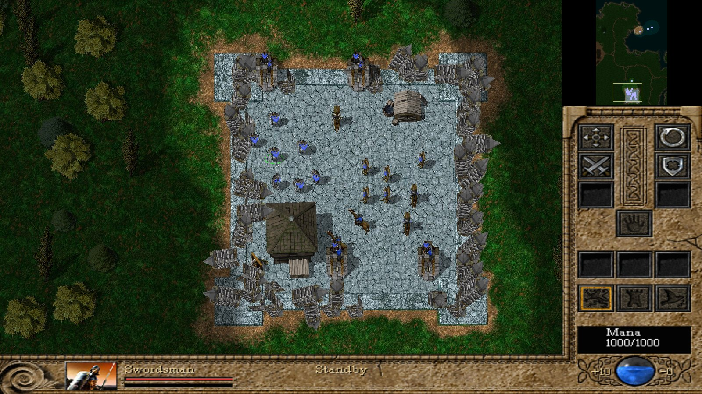
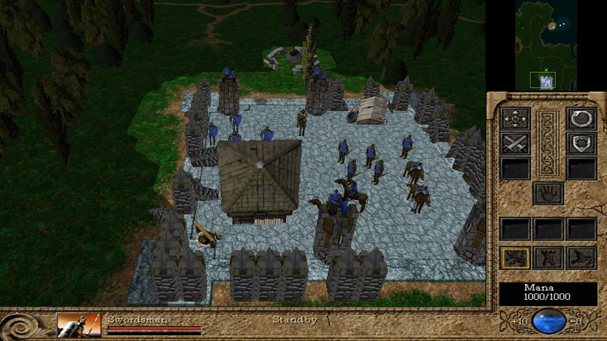
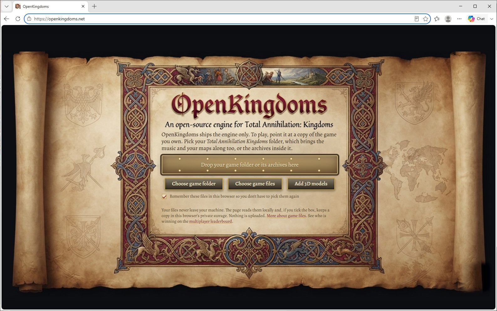
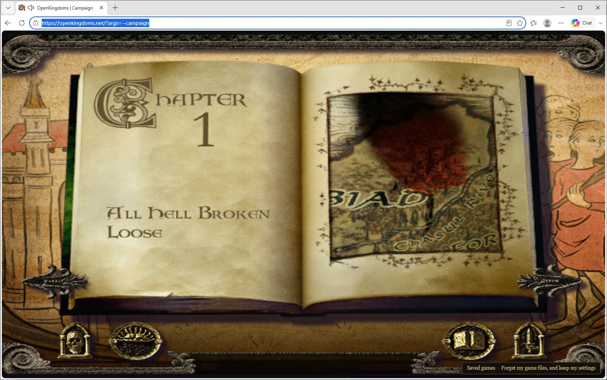
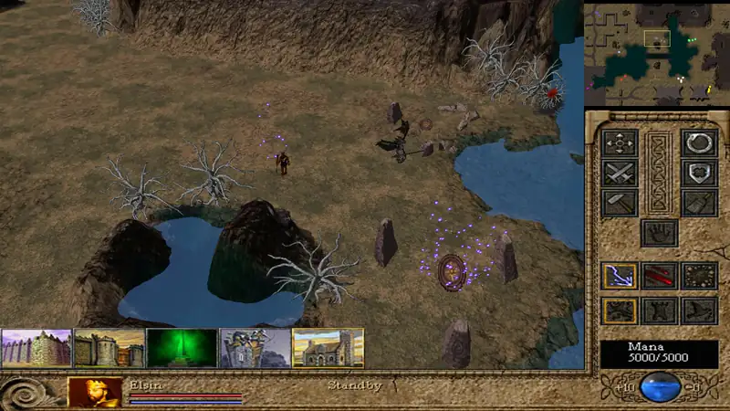
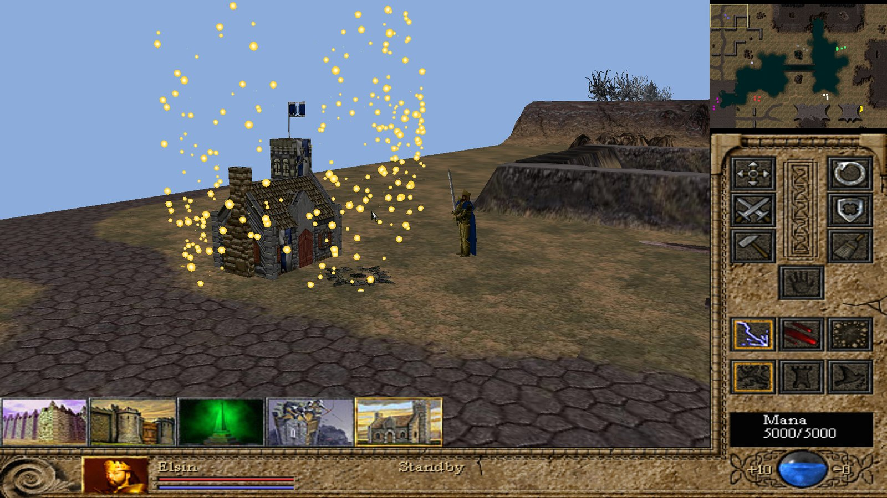
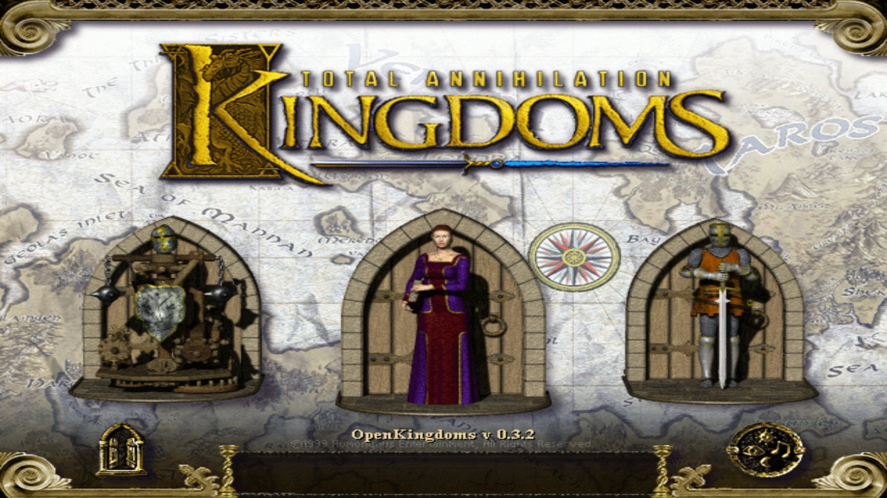
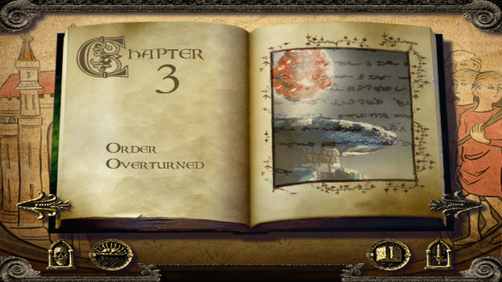
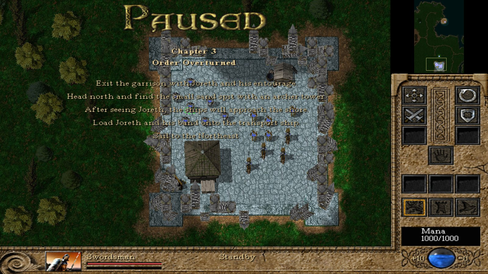
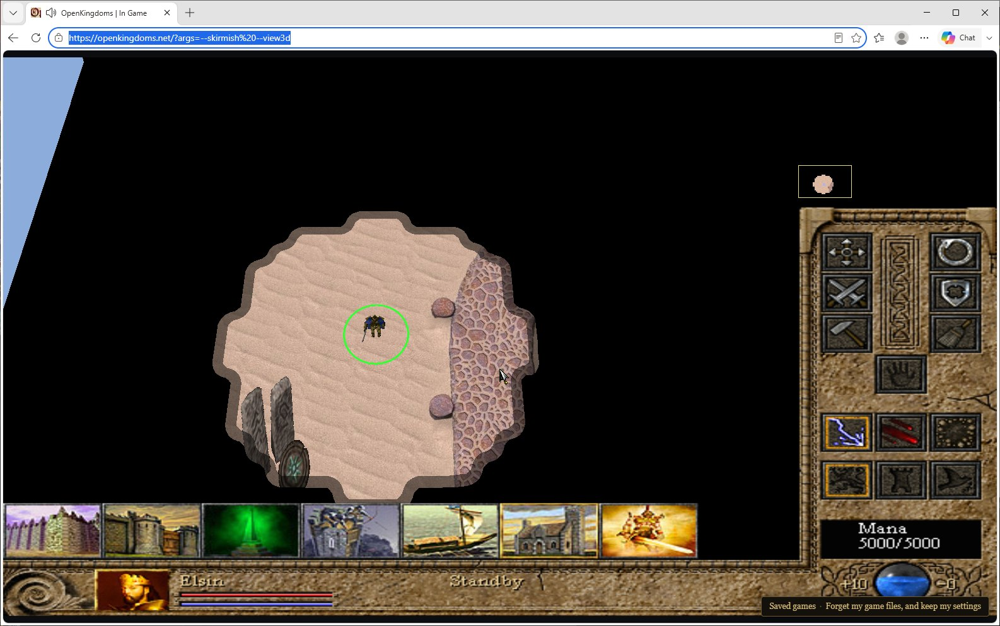

<p align="center">
  
</p>

# OpenKingdoms

A from-scratch, open-source engine for **Total Annihilation: Kingdoms**
(Cavedog, 1999), written in C11. It runs natively on Windows, macOS and
Linux, and in the browser via WebAssembly.

OpenKingdoms is a reimplementation rather than a mod or a patch. The original
game's rules, meaning its economy, unit behaviour, combat maths, animation
system, AI, mission scripts and map format, have been reconstructed and
reimplemented so the game runs on modern machines without DirectDraw,
DirectPlay or a 1999 CPU.

> You need your own copy of the game. OpenKingdoms ships the engine only. It
> contains no units, models, textures, sounds, maps or music. Those are still
> owned by their rights holders and we don't distribute them. Point
> OpenKingdoms at a copy of the game you own and it does the rest. See
> [docs/ASSETS.md](docs/ASSETS.md).

<p align="center">
  <a href="https://openkingdoms.net/"></a>
  <a href="https://github.com/OpenKingdoms/OpenKingdoms/releases/latest"></a>
</p>

<p align="center">
  <a href="https://github.com/OpenKingdoms/OpenKingdoms/actions/workflows/ci.yml"></a>
  <a href="LICENSE"></a>
  <a href="https://github.com/OpenKingdoms/OpenKingdoms/releases"></a>
</p>

<table>
  <tr>
    <td width="50%"></td>
    <td width="50%"></td>
  </tr>
  <tr>
    <td align="center"><sub>The classic view, as the game has always looked</sub></td>
    <td align="center"><sub>The same battle in the experimental 3D view, one key away</sub></td>
  </tr>
</table>

---

## Get it

**[Play in your browser](https://openkingdoms.net/)** with nothing to install,
or download a desktop build:

| | |
|---|---|
| **Browser** | **[openkingdoms.net](https://openkingdoms.net/)**, Chrome, Edge, Firefox or Safari |
| **Windows** | [Latest release](https://github.com/OpenKingdoms/OpenKingdoms/releases/latest), `windows-x64.zip` |
| **macOS** | [Latest release](https://github.com/OpenKingdoms/OpenKingdoms/releases/latest), `macos-arm64` for Apple silicon. Intel Macs [build from source](#building-from-source) |
| **Linux** | [Latest release](https://github.com/OpenKingdoms/OpenKingdoms/releases/latest), `linux-x86_64.tar.gz` |
| **Source** | [Build it yourself](#building-from-source), Windows, macOS and Linux |

Every download needs your own copy of the game. The desktop builds find it
for you, and ask once if they cannot. See
[getting your game files in](#getting-your-game-files-in).

---

## Status

| Area | State |
|---|---|
| Skirmish vs AI | Playable. Economy, building, combat, magic, victory conditions, all four kingdoms and Creon with The Iron Plague |
| Campaign | Playable. The Book of Darien and The Iron Plague, with mission scripts, briefings and cut scenes |
| Multiplayer | Playable. Deterministic lockstep over a relay, browser and desktop players in one game, invite links and a game data check |
| Rendering | 3DO models, GAF/TAF sprites, COB animation, team colours, fog of war, and an experimental 3D view |
| AI | Numbered attack and raid groups, goal planning, and squads that keep together and flank |
| Movement | Footprint-aware routes, crowds that give way, shared routes for large groups |
| Maps | TNT loading, heightmaps, features, map packs |
| Saves | Save and load anywhere, in the campaign and in skirmish |
| Mods | TAK Enhanced, folder mods of loose files, a mod set chooser, and a data check for modded multiplayer |
| Sound | Effects, music and cut scene soundtracks |

Expect rough edges. This is a preservation project under active development
and it isn't a finished product.

---

## Play in your browser

The fastest way in, with nothing to install:

1. Open **<https://openkingdoms.net/>**
2. Point it at your Total Annihilation: Kingdoms folder (that brings the
   music and cut scenes along too), or drop the `.hpi` files from it onto
   the page.
3. Press Start and play.

<table>
  <tr>
    <td width="50%"></td>
    <td width="50%"></td>
  </tr>
  <tr>
    <td align="center"><sub>Pick your game folder and press Start</sub></td>
    <td align="center"><sub>The whole game in a browser tab, campaign included</sub></td>
  </tr>
</table>

Your game files never leave your machine. The page reads them locally and,
if you leave the box ticked, keeps a copy in the browser's own storage so
the next visit boots straight in. A "Forget my game files" link at the
bottom of the page clears that copy.

Chrome and Edge can pick the whole folder. Firefox and Safari take the
`.hpi` files themselves, either through the file button or by
drag-and-drop. The archives are around 300 MB, so the first load takes a
moment and the tab needs a machine with a few GB of memory. Cut scenes are
read from your folder a piece at a time, so they cost no extra memory.

The page is rebuilt from `main` on every push, so it always matches the
latest code, rough edges included.

---

## The 3D view

Press **V** in any battle and the same battle is drawn in 3D under a free
camera, in the browser as well as on the desktop. Press V again and the
classic view is back with nothing lost. It is experimental: the world,
your selection and every order carry on untouched while you switch.

<table>
  <tr>
    <td width="50%"></td>
    <td width="50%"></td>
  </tr>
  <tr>
    <td align="center"><sub>A flyer attacks a monarch at the water's edge</sub></td>
    <td align="center"><sub>A building going up, with its build sparkle</sub></td>
  </tr>
</table>

| Key | Does |
|---|---|
| V | Switch between the classic view and the 3D view |
| Q and E | Orbit the camera left and right |
| R and F | Tilt the camera up and down |
| Z and X, mouse wheel | Zoom in and out |
| Middle button drag | Orbit and tilt |
| Home | Back to the classic angle over the same spot |

The 3D view draws the game's own 3DO models. It can also draw a model of
your own in place of any of them: drop a glTF file named after the unit
into a `models3d` folder beside your game files. See
[docs/CUSTOM_MODELS.md](docs/CUSTOM_MODELS.md).

---

## Faithful, with improvements

OpenKingdoms aims at behavioural parity with the original game, and that is
the baseline rather than the ceiling. Where the original was limited by 1999
hardware, or by technology that no longer exists, we improve on it. Every
improvement is written down in
[docs/MANUAL_DEVIATIONS.md](docs/MANUAL_DEVIATIONS.md) so nobody mistakes it
for an accident.

These improvements are in already:

- Runs natively on Windows, macOS and Linux, and compiles to WebAssembly for
  the browser. No DirectDraw, DirectPlay, Glide or 8-bit palette modes, no CD
  check, no installer, no registry.
- Play in the browser with your own game files and nothing to install.
- Any resolution, windowed or fullscreen, through the `--width`, `--height`,
  `--fullscreen` and `--windowed` flags, rendered on the GPU. The original ran
  fixed 8-bit modes.
- An experimental 3D view of any battle, with custom glTF models.
- Mods side by side. TAK Enhanced works as it is, a mod can be a plain folder
  of loose files, and you choose the mod set to play from a list. See
  [docs/MODDING.md](docs/MODDING.md).
- The simulation runs at 60 Hz instead of 30. Unit rates from the data files
  are converted so speeds, reload times and build times come out the same, and
  movement and animation are twice as smooth.
- Up to 2000 units per player. The original's setup screen topped out at 500.
- Movement that respects unit footprints, so a large unit never plans through
  a gap only a small one fits, units that give way to each other, and a
  stuck unit that finds another way or gives up rather than grinding forever.
- An AI that fights in numbered groups, plans with goals, keeps its squads
  together on the march and sends its archers round the side of a target.
- A downloaded build finds your game folder, asks once if it can't, and
  remembers it. `--game-dir` names one outright.
- Developer tooling the original never had: asset validators, a COB script
  inspector and disassembler, a map inspector, render probes, and a test suite
  that runs the animation VM against every script in the game.

These are still to come:

- Replays recorded from the lockstep command stream.
- Smooth play with 1000 units on screen.

---

## More pictures

<table>
  <tr>
    <td width="50%"></td>
    <td width="50%"></td>
  </tr>
  <tr>
    <td align="center"><sub>The main menu, doors and all</sub></td>
    <td align="center"><sub>The Book of Deeds, where the campaigns live</sub></td>
  </tr>
  <tr>
    <td width="50%"></td>
    <td width="50%"></td>
  </tr>
  <tr>
    <td align="center"><sub>A chapter opens paused under its briefing</sub></td>
    <td align="center"><sub>The 3D view runs in the browser too</sub></td>
  </tr>
</table>

---

## Building from source

Every release is built by CI from a tag, so you only need this to develop
or to build for a platform we do not ship. To play, take a
[release](https://github.com/OpenKingdoms/OpenKingdoms/releases/latest) or
the [browser](https://openkingdoms.net/).

### Windows

Requires [Visual Studio 2022 or later](https://visualstudio.microsoft.com/) (Desktop
C++ workload), [CMake](https://cmake.org/download/) 3.20+, and
[vcpkg](https://vcpkg.io/).

The first configure also builds FFmpeg through vcpkg. That is what plays
the short clips behind the main menu doors and the loading screen. Pass
`-DVCPKG_MANIFEST_NO_DEFAULT_FEATURES=ON` to skip it and get still
sprites in those two places instead.

```powershell
git clone https://github.com/OpenKingdoms/OpenKingdoms.git
cd OpenKingdoms
cmake -B build -DCMAKE_TOOLCHAIN_FILE=<vcpkg>/scripts/buildsystems/vcpkg.cmake `
      -DTAK_GAME_DIR="C:\GOG Games\Total Annihilation Kingdoms"
cmake --build build --config Release
.\build\src\Release\tak-re.exe
```

---

### macOS

Builds on both Apple silicon and Intel. Released builds are unsigned, so a
download needs `xattr -dr com.apple.quarantine OpenKingdoms` once.

```bash
brew install cmake sdl2 ninja
git clone https://github.com/OpenKingdoms/OpenKingdoms.git
cd OpenKingdoms
cmake -B build -G Ninja -DCMAKE_BUILD_TYPE=Release       -DTAK_GAME_DIR="/path/to/Total Annihilation Kingdoms"
cmake --build build
./build/src/tak-re
```

---

### Linux

Install dependencies:

```bash
# Debian / Ubuntu
sudo apt install build-essential cmake ninja-build libsdl2-dev

# Fedora
sudo dnf install gcc cmake ninja-build SDL2-devel

# Arch
sudo pacman -S base-devel cmake ninja sdl2
```

Then:

```bash
git clone https://github.com/OpenKingdoms/OpenKingdoms.git
cd OpenKingdoms
cmake -B build -G Ninja -DCMAKE_BUILD_TYPE=Release       -DTAK_GAME_DIR="/path/to/Total Annihilation Kingdoms"
cmake --build build
./build/src/tak-re
```

You don't need Wine or Proton. OpenKingdoms is a native port rather than a
compatibility layer.

---

## Getting your game files in

OpenKingdoms reads the original game's `.hpi` archives directly and never
copies or ships them.

A downloaded build looks for your copy in the usual install locations and
remembers what it finds, so most people start it and play. If it cannot find
one it prints what to do, and you can name the folder in any of these ways:

```
OpenKingdoms --game-dir "C:\GOG Games\Total Annihilation Kingdoms"
export TAK_GAME_DIR="$HOME/Games/Total Annihilation Kingdoms"
```

or put a copy in a folder called `game` beside the binary. In the browser you
point the page at the folder instead, and the files never leave your machine.

A build you compile yourself can also bake a default in with
`-DTAK_GAME_DIR`, which is what the development setup does.

Where to get a copy if you don't have one:

- GOG sells it as part of the *Total Annihilation Commander Pack*.
- Original CDs work fine. Copy the game folder off the disc.

Full details are in [docs/ASSETS.md](docs/ASSETS.md), and mods are covered
in [docs/MODDING.md](docs/MODDING.md).

---

## Multiplayer

Lockstep netcode over a lightweight relay. The server passes command frames
between players and holds no game state and no game data, so hosting one for
your friends is cheap and legally uncomplicated.

Choose Multiplayer, type the address of a server and press Enter. The
address is remembered. Anyone on that server can host a game or join one,
and a browser player and a desktop player use the same server. In the
browser the server is already filled in.

A new game puts its invite link at the top of its chat and on your
clipboard, as `https://openkingdoms.net/?join=CODE`. Paste it to a friend
and the page takes them straight into your game once their game files are
loaded. A desktop build joins the same way with `--join CODE`.

Every player's game data is fingerprinted when they connect. A game whose
data differs from yours, because one of you has a mod or another release,
is greyed in the list, and joining it says which part differs. Run the
game with `--data-report` to see the hash of every file.

A room holds any of them. Windows, macOS, Linux and browser players play
together, because the simulation carries its own trigonometry rather than
borrowing each platform's maths library, which used to round a sine its own
way and pull two machines apart over a match. Two gates in CI keep it that
way, and a build old enough to predate them is still refused rather than
desynced, listed greyed with the reason. The measurement and what was done
about it are in
[docs/notes/2026-09-14-float-determinism.md](docs/notes/2026-09-14-float-determinism.md).

See [docs/MULTIPLAYER.md](docs/MULTIPLAYER.md) for the design.

---

## Contributing

Contributions are very welcome, especially from people who know the original
game well. Accuracy reports are as valuable as code. If something behaves
differently from the 1999 game, that's a bug worth filing.

Start with [CONTRIBUTING.md](CONTRIBUTING.md). The main points:

- OpenKingdoms aims at behavioural parity with the original. Changes to game
  behaviour need evidence, such as a note in `docs/notes/`, a manual
  reference, or a reproducible in-game observation. Improvements on the
  original are welcome as long as they get recorded as deviations in
  [docs/MANUAL_DEVIATIONS.md](docs/MANUAL_DEVIATIONS.md).
- Build both the native and the WebAssembly target before opening a PR.
  Emscripten's clang rejects things MSVC accepts.
- Tests live beside the code as `test_*.c`. CI runs the data-free subset and
  maintainers run the full suite.

---

## Contributors

The people whose pull requests have been merged into OpenKingdoms,
in the [all-contributors](https://allcontributors.org) way.

<table>
  <tr>
    <td align="center" valign="top" width="20%">
      <a href="https://github.com/zbennett10"><br /><sub><b>Zachary Bennett</b></sub></a><br />
      <sub>engine, project lead</sub>
    </td>
    <td align="center" valign="top" width="20%">
      <a href="https://github.com/DoubyCz"><br /><sub><b>Jiří Doubravský</b></sub></a><br />
      <sub>menu and Options fixes, Linux testing</sub>
    </td>
  </tr>
</table>

A merged pull request puts you here. See [Contributing](#contributing).

## How this was built

OpenKingdoms is a reimplementation, written from scratch in C. The original
game's behaviour, covering economy, combat, animation, AI and map handling,
is described in our own words in [docs/notes/](docs/notes/), and those notes
are the reference contributors work from. No original game code or content is
included in this repository, and none ever will be.

[docs/PARITY.md](docs/PARITY.md) explains what parity means here and how
claims are evidenced.
[docs/MANUAL_DEVIATIONS.md](docs/MANUAL_DEVIATIONS.md) records the departures
from the original that were made on purpose, and why.
[docs/DATA_FORMATS.md](docs/DATA_FORMATS.md) is the file format reference
(HPI, 3DO, GAF/TAF, COB, TNT, TDF/FBI).

---

## Licence and attribution

OpenKingdoms is licensed under the **GNU General Public License v3.0**. See
[LICENSE](LICENSE).

Third-party components keep their own licences: FFmpeg (LGPL 2.1 or
later, built with only the Bink video and audio decoders so the menu doors
and cut scenes play with their sound), SDL2 (zlib), miniaudio
(public domain / MIT-0), stb_image (MIT / public domain), miniz (MIT).

*Total Annihilation: Kingdoms* is a trademark of its respective owners.
This project is not affiliated with, endorsed by, or supported by Cavedog
Entertainment, Atari, or any current rights holder. No game assets are
distributed here.
